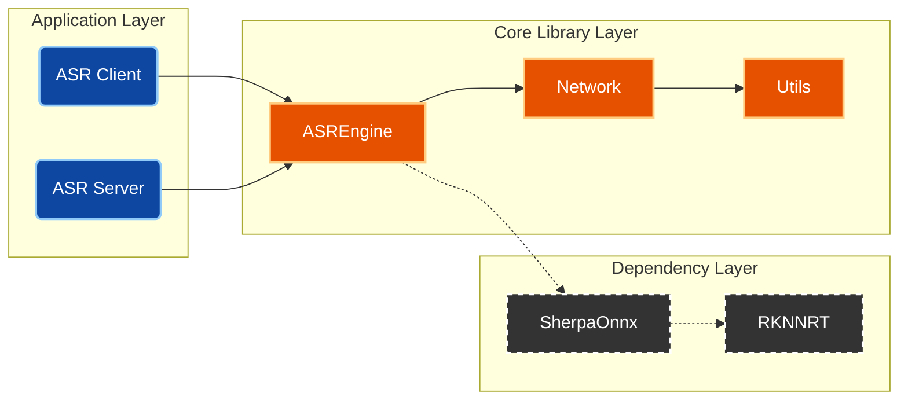

<div align="center">
  <h1>ArcForge Automatic Speech Recognition (ASR) SDK</h1>
  <p><i>High-Performance Embedded ASR Inference Framework based on Modern CMake</i></p>
</div>

<p align="center">
  
</p>

<p align="center">
  <a href="#"></a>
  <a href="#"></a>
  <a href="#"></a>
</p>

<p align="center">
  <strong>English</strong> | <a href="docs/zh-cn/README_ZH_CN.md">简体中文</a>
</p>

---

### 📖 Introduction

ArcForge is a C++ ASR inference framework designed specifically for **edge computing**.
It integrates the `sherpa-zipformer` model, implementing a complete pipeline from low-level NPU binding to high-level Client/Server calls. The standout feature of this project is **"Architectural Transparency"** — we fully disclose and deconstruct the complete industrial-grade Modern CMake build logic.

### 🏗️ Architecture

We provide not just the source code, but also a **fully visualized** build system.

> **🔍 Deep Dive**: [**ArcForge Build System Explained (BUILD_SYSTEM.md)**](docs/en/BUILD_SYSTEM.md)
> *(Click the link above to view the Build Lifecycle, Core DSL Logic, and Detailed Dependency Topology)*

**Core Module Overview:**



---

### 🚀 Quick Start

This project relies heavily on `.env` for environment isolation. Please strictly follow the steps below:

#### 1. Environment Configuration (Required)

```bash
# 1. Copy the configuration template
cp .env.example .env

# 2. Edit the configuration file
#    ARC_RV1126BP_SDK_ROOT: Path to your cross-compilation toolchain root (Required)
#    ARC_DEP_CACHE_DIR:     Path to third-party library cache (Recommended for faster builds)
vim .env
```

#### 2. Build

Use the `build.sh` script to drive CMake Presets:

```bash
# [Recommended] Clean Build (RV1126 Release)
./build.sh cb rv1126bp

# [Dev] Incremental Build (Compile only modified parts)
./build.sh build rv1126bp

# [Debug] Native Verification (x86 Debug)
./build.sh cb native debug
```

---

### ⌨️ Command Cheatsheet

| Scenario | Command | Description |
| :--- | :--- | :--- |
| **Production** | `./build.sh cb rv1126bp` | Clean & Build Release version (-O3) |
| **Debugging** | `./build.sh cb rv1126bp debug` | Build Debug version (with symbols, -Og) |
| **Cleanup** | `./build.sh cleanall` | Remove `build/` and `install/` directories |
| **Git Clean** | `git clean -fdx -e .env` | **Caution**: Remove all untracked files (keeps config) |

---

### 📂 Output Directory

After building, artifacts are located in the `install/` directory. We automatically handle renaming and RPATH settings, so they are ready for deployment:

```text
install/rv1126bp/release/
├── bin/
│   ├── ArcForge_ASR_Client      # Client test application
│   └── ArcForge_ASR_Server      # Server main application
└── lib/
    ├── libarcforge_asrengine.so # Core engine library
    ├── libarcforge_network.so   # Network library
    ├── libarcforge_utils.so     # Basic utilities library
    └── libsherpa-onnx*.so       # Dependency library
```


### 🧩 Supporting New Platforms

Currently, only RV1126BP and RK3588S platforms are supported. To support a new platform, there are two suggested methods:

#### 1. Add it yourself

Please read this tutorial carefully:

> **🔍 Deep Dive**: [**How to Add Support for a New SoC in ArcForge(ADD_NEW_SOC.md)**](./docs/en/ADD_NEW_SOC.md)
> *(Click the link above to view detailed steps guiding you through supporting a new SoC)*

#### 2. Submit an issue to me