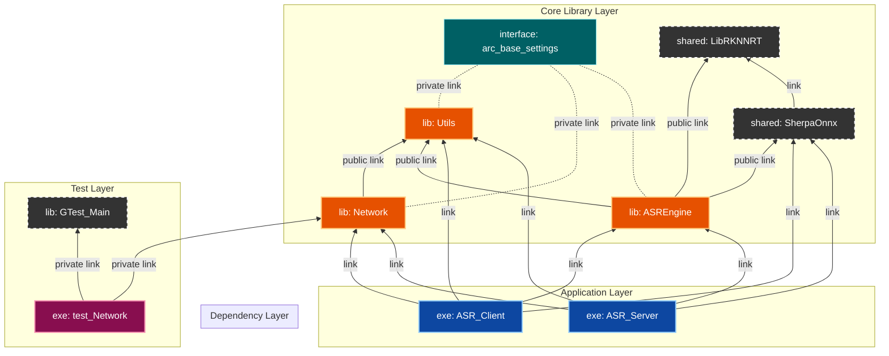
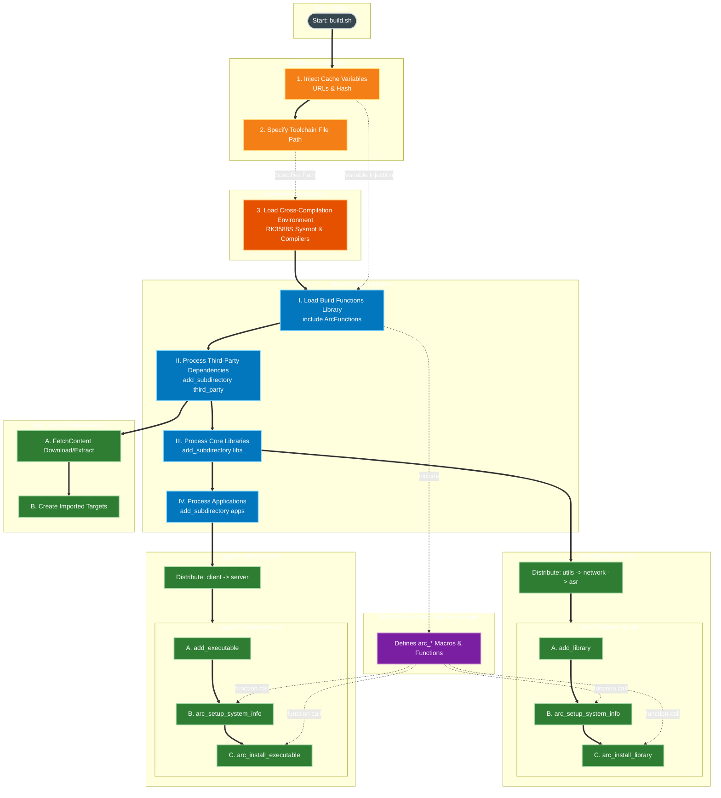

# ArcForge Build System Explained

This document aims to reveal the build system architecture of the ArcForge project. The project adopts the **"Modern CMake"** philosophy, achieving automation and standardization of build logic through a highly encapsulated DSL (Domain-Specific Language).

---

## 1. Core Architecture View

### 1.1 Module Dependency Topology (Module Topology)
ArcForge employs a strict layered architecture. Lower-level modules are invisible to upper layers, while upper layers inherit lower-level functionalities through interfaces.

<!-- Please paste the Mermaid code for [Figure 3: Module Dependency Topology (Dependency Graph)] here -->
<!-- Suggest using graph BT or LR layout -->


### 1.2 Design Principles
*   **Single Source of Truth**: `build.sh` acts solely as an entry point; build dependencies are entirely controlled by the CMake DAG.
*   **Out-of-Source Build**: Build artifacts are strictly isolated in the `build/` directory, preventing contamination of the source tree.
*   **DSL Driven**: Implementation modules contain minimal logic, relying solely on standard interfaces provided by `ArcFunctions`.

---

## 2. Build Lifecycle (Build Lifecycle)

This section details the entire process from executing `build.sh` to generating artifacts, illustrating the flow of control between scripts, configuration files, and CMake.

<!-- Please paste the Mermaid code for [Figure 1: ArcForge Build Process & File Interaction] here -->
<!-- Suggest using graph TB layout -->


**Key Phase Explanations:**
1.  **Pre-Configure (Preset)**: `CMakePresets.json` injects Toolchain and dependency version information.
2.  **Orchestration (Root)**: The root `CMakeLists.txt` acts as the conductor, loading the DSL and dispatching tasks.
3.  **Execution (Subdirs)**: Subdirectories invoke the DSL to perform specific compilation and linking.

---

## 3. Build Black Magic: ArcFunctions DSL

To simplify `CMakeLists.txt` writing, the project encapsulates `cmake/ArcFunctions.cmake`. The following diagrams illustrate the automatic operations performed when you call `arc_install_library` or `arc_setup_system_info`.

```mermaid
graph TB
    %% ==========================================
    %% 样式定义 (图2专用)
    %% ==========================================
    classDef fileContainer fill:#263238,stroke:#90a4ae,stroke-width:2px,stroke-dasharray: 5 5,color:#fff;
    classDef initGroup fill:#1565c0,stroke:#90caf9,stroke-width:2px,color:#fff;
    classDef setupGroup fill:#ef6c00,stroke:#ffcc80,stroke-width:2px,color:#fff;
    classDef installGroup fill:#2e7d32,stroke:#a5d6a7,stroke-width:2px,color:#fff;
    classDef testGroup fill:#c2185b,stroke:#f48fb1,stroke-width:2px,color:#fff;
    classDef nodeStep fill:#455a64,stroke:#cfd8dc,stroke-width:1px,color:#fff;

    subgraph ArcFunctions_File [ArcFunctions.cmake 工具箱]
        direction TB

        %% ==========================================
        %% 1. 全局初始化簇
        %% ==========================================
        subgraph Cluster_Init [1.全局初始化类]
            direction TB

            subgraph Func_Ver [arc_extract_version_from_changelog]
                direction TB
                V1[读取 CHANGELOG.md]:::nodeStep --> V2[正则匹配 ## vX.Y.Z]:::nodeStep
                V2 --> V3[导出 ARC_PROJECT_VERSION]:::nodeStep
            end

            subgraph Func_Meta [arc_init_project_metadata]
                direction TB
                M1[获取 Version 变量]:::nodeStep --> M2[设置作者 PotterWhite]:::nodeStep
                M2 --> M3[生成 UTC 时间戳]:::nodeStep
                M3 --> M4[导出 GLOBAL__变量]:::nodeStep
            end

            subgraph Func_Global [arc_init_global_settings]
                direction TB
                G1[创建接口库 arc_base_settings]:::nodeStep
                G2[强制 C++17 & PIC]:::nodeStep --> G1
                G3[设置 -Wall -Werror]:::nodeStep --> G1
                G4[根据 Debug/Release 设优化级]:::nodeStep --> G1
                G5[导出 BUILD_TYPE]:::nodeStep --> G1
            end
        end
        class Cluster_Init initGroup

        %% ==========================================
        %% 2. 目标配置簇
        %% ==========================================
        subgraph Cluster_Setup [2.目标配置类]
            direction TB

            subgraph Func_SetupInfo [arc_setup_system_info]
                direction TB
                S1[校验命名空间]:::nodeStep --> S2[生成 system-info.h]:::nodeStep
                S2 --> S3[设置 Include 路径 src/gen]:::nodeStep
                S3 --> S4[挂载 PCH 预编译头]:::nodeStep
                S4 --> S5[设置 SOVERSION]:::nodeStep
                S5 --> S6[链接 arc_base_settings]:::nodeStep
            end

            subgraph Func_GenHeader [arc_generate_system_info_header]
                direction TB
                H1[生成通用 system-info-gen.h]:::nodeStep --> H2[创建接口库 project_version_info]:::nodeStep
            end
        end
        class Cluster_Setup setupGroup

        %% ==========================================
        %% 3. 安装部署簇
        %% ==========================================
        subgraph Cluster_Install [3.安装部署类]
            direction TB

            subgraph Func_InstLib [arc_install_library]
                direction TB
                L1[安装头文件 include/]:::nodeStep --> L2[安装二进制 lib/ bin/]:::nodeStep
                L2 --> L3[生成 ConfigVersion.cmake]:::nodeStep
                L3 --> L4[生成 Config.cmake]:::nodeStep
                L4 --> L5[导出 Targets.cmake]:::nodeStep
            end

            subgraph Func_InstExe [arc_install_executable]
                direction TB
                E1[安装 Target 到 bin/]:::nodeStep
            end
        end
        class Cluster_Install installGroup

        %% ==========================================
        %% 4. 质量保证簇
        %% ==========================================
        subgraph Cluster_Test [4.测试集成类]
            direction TB

            subgraph Func_AddTest [arc_add_test]
                direction TB
                T1[定义 exe 名称 test_Target]:::nodeStep
                T1 --> T2[链接 GTest::gtest_main]:::nodeStep
                T2 --> T3[链接 被测库 ArcForge::Target]:::nodeStep
                T3 --> T4[注入私有头文件路径 /src]:::nodeStep
                T4 --> T5[注册 gtest_discover_tests]:::nodeStep
            end
        end
        class Cluster_Test testGroup

    end
    class ArcFunctions_File fileContainer
```

<!-- Please paste the Mermaid code for [Figure 2: ArcFunctions Core Logic (The Arc Magic)] here -->
<!-- Suggest using graph LR layout, ensuring Init/Setup/Install/Test clusters are included -->


**DSL's Automated Features:**
*   **Version Injection**: Automatically generates `system-info.h` with Git version and build timestamp.
*   **Standardized Installation**: Automatically handles RPATH, generates `Config.cmake` and `Targets.cmake` for standard `find_package`.
*   **Environment Isolation**: Automatically configures PCH (Precompiled Headers) and different Include paths for Build/Install phases.

---

## 4. Integration Guide (Integration Guide)

### 4.1 Internal Module Development
When developing new modules, simply call the DSL; no need to manage installation rules directly:

```cmake
# libs/new_module/CMakeLists.txt

add_library(MyModule)
# 1. Automatically configure headers, version, and alias
arc_setup_system_info(MyModule)
# 2. Link dependencies (using namespaced aliases)
target_link_libraries(MyModule PUBLIC ArcForge::Utils)
# 3. Automatically generate installation rules
arc_install_library(MyModule ${INCLUDE_DIR})
```

### 4.2 External SDK Usage
When `build/install` is packaged for distribution, third-party applications can integrate using standard CMake:

```cmake
# 1. Find the package (CMake will automatically read lib/cmake/Utils/ArcForge_UtilsConfig.cmake)
find_package(ArcForge_Utils REQUIRED)

# 2. Link (Must use the ArcForge:: prefix)
target_link_libraries(UserApp PRIVATE ArcForge::Utils)
```

---

## 5. Maintenance Command Cheatsheet

| Operation | Command | Description |
| :--- | :--- | :--- |
| **Full Build** | `./build.sh cb <plat>` | Cleans and rebuilds (Clean Build) |
| **Incremental Build** | `./build.sh build <plat>` | Compiles only modified parts, recommended for development |
| **Debug Build** | `./build.sh cb <plat> debug` | Builds with debug symbols, no optimization (-Og) |
| **Full Cleanup** | `git clean -fdx -e .env` | **Use with Caution**: Removes all untracked files (preserves .env) |