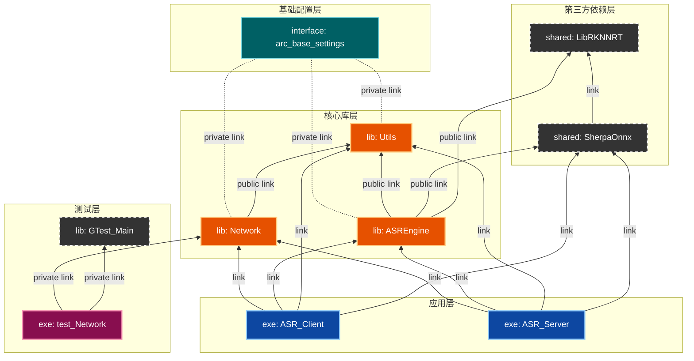
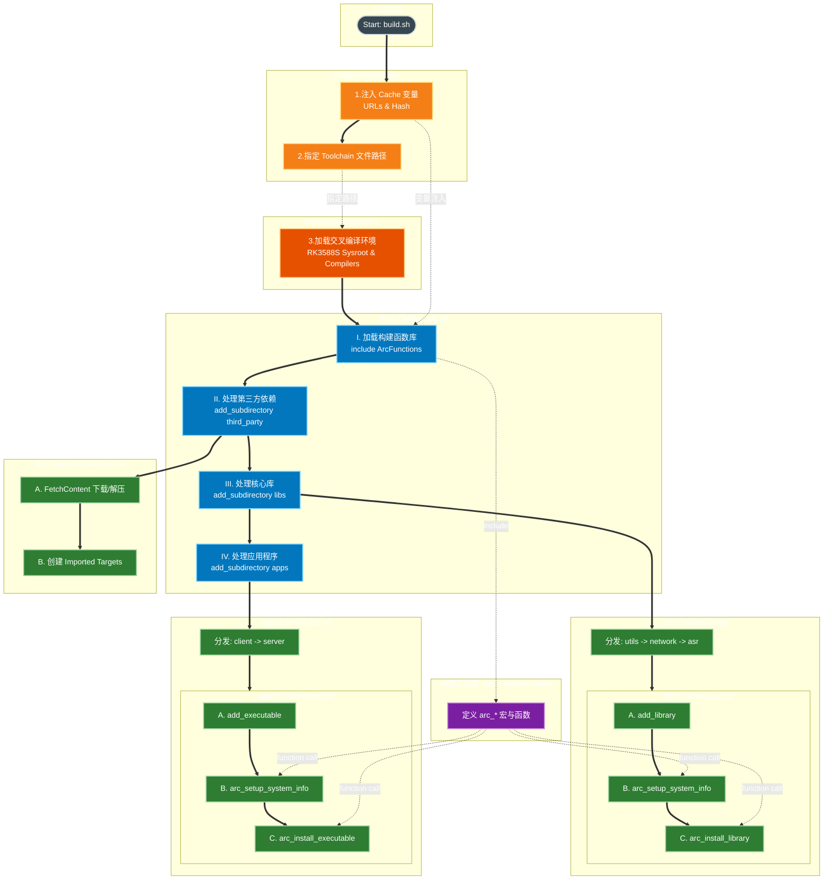

# ArcForge 构建系统详解

本文档旨在揭示 ArcForge 项目的构建系统架构。项目采用 **"Modern CMake"** 理念，通过高度封装的 DSL（领域特定语言）实现了构建逻辑的自动化与标准化。

---

## 1. 核心架构视图

### 1.1 模块依赖拓扑 (Module Topology)
ArcForge 采用严格的分层架构。底层模块对上层不可见，上层通过接口继承底层功能。

<!-- 请在此处粘贴 [图三：模块依赖架构图 (Dependency Graph)] 的 Mermaid 代码 -->
<!-- 建议使用 graph BT 或 LR 布局 -->


### 1.2 设计原则
*   **单一事实来源**：`build.sh` 仅作入口，构建依赖关系完全由 CMake DAG 控制。
*   **源码外构建**：构建产物严格隔离在 `build/` 目录，禁止污染源码树。
*   **DSL 驱动**：业务模块（Implementation）不包含复杂逻辑，仅调用 `ArcFunctions` 提供的标准接口。

---

## 2. 构建生命周期 (Build Lifecycle)

从执行 `build.sh` 到产物生成，控制权在脚本、配置文件与 CMake 之间流转的全过程。

<!-- 请在此处粘贴 [图一：ArcForge 构建流程图 (Build Process & File Interaction)] 的 Mermaid 代码 -->
<!-- 建议使用 graph TB 布局 -->


**关键阶段说明：**
1.  **Pre-Configure (Preset)**：`CMakePresets.json` 注入工具链（Toolchain）与依赖版本信息。
2.  **Orchestration (Root)**：根目录 `CMakeLists.txt` 作为指挥中心，加载 DSL 并分发任务。
3.  **Execution (Subdirs)**：子目录调用 DSL 完成具体的编译与链接。

---

## 3. 构建黑科技：ArcFunctions DSL

为了简化 `CMakeLists.txt` 的编写，项目封装了 `cmake/ArcFunctions.cmake`。以下图表展示了当你调用 `arc_install_library` 或 `arc_setup_system_info` 时，系统内部自动执行的操作。

```mermaid
graph TB
    %% ==========================================
    %% 样式定义 (图2专用)
    %% ==========================================
    classDef fileContainer fill:#263238,stroke:#90a4ae,stroke-width:2px,stroke-dasharray: 5 5,color:#fff;
    classDef initGroup fill:#1565c0,stroke:#90caf9,stroke-width:2px,color:#fff;
    classDef setupGroup fill:#ef6c00,stroke:#ffcc80,stroke-width:2px,color:#fff;
    classDef installGroup fill:#2e7d32,stroke:#a5d6a7,stroke-width:2px,color:#fff;
    classDef testGroup fill:#c2185b,stroke:#f48fb1,stroke-width:2px,color:#fff;
    classDef nodeStep fill:#455a64,stroke:#cfd8dc,stroke-width:1px,color:#fff;

    subgraph ArcFunctions_File [ArcFunctions.cmake 工具箱]
        direction TB

        %% ==========================================
        %% 1. 全局初始化簇
        %% ==========================================
        subgraph Cluster_Init [1.全局初始化类]
            direction TB

            subgraph Func_Ver [arc_extract_version_from_changelog]
                direction TB
                V1[读取 CHANGELOG.md]:::nodeStep --> V2[正则匹配 ## vX.Y.Z]:::nodeStep
                V2 --> V3[导出 ARC_PROJECT_VERSION]:::nodeStep
            end

            subgraph Func_Meta [arc_init_project_metadata]
                direction TB
                M1[获取 Version 变量]:::nodeStep --> M2[设置作者 PotterWhite]:::nodeStep
                M2 --> M3[生成 UTC 时间戳]:::nodeStep
                M3 --> M4[导出 GLOBAL__变量]:::nodeStep
            end

            subgraph Func_Global [arc_init_global_settings]
                direction TB
                G1[创建接口库 arc_base_settings]:::nodeStep
                G2[强制 C++17 & PIC]:::nodeStep --> G1
                G3[设置 -Wall -Werror]:::nodeStep --> G1
                G4[根据 Debug/Release 设优化级]:::nodeStep --> G1
                G5[导出 BUILD_TYPE]:::nodeStep --> G1
            end
        end
        class Cluster_Init initGroup

        %% ==========================================
        %% 2. 目标配置簇
        %% ==========================================
        subgraph Cluster_Setup [2.目标配置类]
            direction TB

            subgraph Func_SetupInfo [arc_setup_system_info]
                direction TB
                S1[校验命名空间]:::nodeStep --> S2[生成 system-info.h]:::nodeStep
                S2 --> S3[设置 Include 路径 src/gen]:::nodeStep
                S3 --> S4[挂载 PCH 预编译头]:::nodeStep
                S4 --> S5[设置 SOVERSION]:::nodeStep
                S5 --> S6[链接 arc_base_settings]:::nodeStep
            end

            subgraph Func_GenHeader [arc_generate_system_info_header]
                direction TB
                H1[生成通用 system-info-gen.h]:::nodeStep --> H2[创建接口库 project_version_info]:::nodeStep
            end
        end
        class Cluster_Setup setupGroup

        %% ==========================================
        %% 3. 安装部署簇
        %% ==========================================
        subgraph Cluster_Install [3.安装部署类]
            direction TB

            subgraph Func_InstLib [arc_install_library]
                direction TB
                L1[安装头文件 include/]:::nodeStep --> L2[安装二进制 lib/ bin/]:::nodeStep
                L2 --> L3[生成 ConfigVersion.cmake]:::nodeStep
                L3 --> L4[生成 Config.cmake]:::nodeStep
                L4 --> L5[导出 Targets.cmake]:::nodeStep
            end

            subgraph Func_InstExe [arc_install_executable]
                direction TB
                E1[安装 Target 到 bin/]:::nodeStep
            end
        end
        class Cluster_Install installGroup

        %% ==========================================
        %% 4. 质量保证簇
        %% ==========================================
        subgraph Cluster_Test [4.测试集成类]
            direction TB

            subgraph Func_AddTest [arc_add_test]
                direction TB
                T1[定义 exe 名称 test_Target]:::nodeStep
                T1 --> T2[链接 GTest::gtest_main]:::nodeStep
                T2 --> T3[链接 被测库 ArcForge::Target]:::nodeStep
                T3 --> T4[注入私有头文件路径 /src]:::nodeStep
                T4 --> T5[注册 gtest_discover_tests]:::nodeStep
            end
        end
        class Cluster_Test testGroup

    end
    class ArcFunctions_File fileContainer
```

<!-- 请在此处粘贴 [图二：ArcFunctions 核心逻辑 (The Arc Magic)] 的 Mermaid 代码 -->
<!-- 建议使用 graph LR 布局，确保包含 Init/Setup/Install/Test 四个簇 -->


**DSL 带来的自动化特性：**
*   **版本注入**：自动生成 `system-info.h`，包含 Git 版本与构建时间戳。
*   **安装标准化**：自动处理 RPATH，生成 `Config.cmake` 和 `Targets.cmake`，支持标准 `find_package`。
*   **环境隔离**：自动配置 PCH（预编译头）和 Build/Install 阶段不同的 Include 路径。

---

## 4. 集成指南 (Integration Guide)

### 4.1 内部模块开发
新增模块时，无需关心安装规则，只需调用 DSL：

```cmake
# libs/new_module/CMakeLists.txt

add_library(MyModule)
# 1. 自动配置头文件、版本、别名
arc_setup_system_info(MyModule)
# 2. 链接依赖 (使用带命名空间的别名)
target_link_libraries(MyModule PUBLIC ArcForge::Utils)
# 3. 自动生成安装规则
arc_install_library(MyModule ${INCLUDE_DIR})
```

### 4.2 外部 SDK 使用
当 `build/install` 被打包发布后，第三方应用可通过标准 CMake 方式集成：

```cmake
# 1. 查找包 (CMake 会自动读取 lib/cmake/Utils/ArcForge_UtilsConfig.cmake)
find_package(ArcForge_Utils REQUIRED)

# 2. 链接 (必须使用 ArcForge:: 前缀)
target_link_libraries(UserApp PRIVATE ArcForge::Utils)
```

---

## 5. 维护命令速查

| 操作 | 命令 | 说明 |
| :--- | :--- | :--- |
| **全量构建** | `./build.sh cb <plat>` | 清理并重新构建 (Clean Build) |
| **增量构建** | `./build.sh build <plat>` | 仅编译修改部分，开发推荐 |
| **调试版本** | `./build.sh cb <plat> debug` | 带符号表，无优化 (-Og) |
| **彻底清理** | `git clean -fdx -e .env` | **危险**：删除所有未跟踪文件 (保留 .env) |

