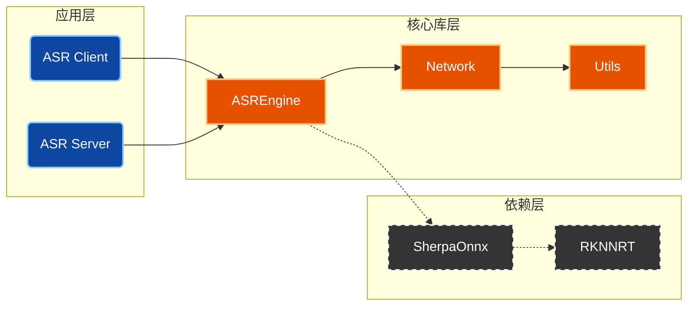

<div align="center">
  <h1>ArcForge 自动语音识别（ASR）软件开发包</h1>
  <p><i>基于 Modern CMake 的高性能嵌入式 ASR 推理框架</i></p>
</div>

<p align="center">
  
</p>

<p align="center">
  <a href="#"></a>
  <a href="#"></a>
  <a href="#"></a>
</p>

<p align="center">
  <a href="../../README.md">English</a> | <strong>简体中文</strong>
</p>

---

### 📖 项目简介

ArcForge 是一个专为**边缘计算**设计的 C++ ASR 推理框架。
它集成了 `sherpa-zipformer` 模型，实现了从底层 NPU 绑定到上层 Client/Server 调用的完整链路。本项目最大的特点是**“架构透明”**——我们公开并解构了完整的工业级 CMake 构建逻辑。

### 🏗️ 系统架构

不仅提供源码，还提供了一套**完全可视化**的构建系统。

> **🔍 深度阅读**：[**ArcForge 构建系统详解 (BUILD_SYSTEM_ZH_CN.md)**](./BUILD_SYSTEM_ZH_CN.md)
> *(点击上方链接，查看构建生命周期、核心函数 DSL 逻辑图及详细依赖拓扑)*

**核心模块概览：**



---

### 🚀 快速上手

本项目强依赖 `.env` 进行环境隔离。请严格按照以下步骤操作：

#### 1. 环境配置 (必做)

```bash
# 1. 复制环境配置模板
cp .env.example .env

# 2. 编辑配置文件
#    ARC_RV1126BP_SDK_ROOT: 指向你的交叉编译工具链根目录 (必填)
#    ARC_DEP_CACHE_DIR:     指向第三方库缓存目录 (推荐配置，加速构建)
vim .env
```

#### 2. 编译构建

使用 `build.sh` 脚本驱动 CMake Presets：

```bash
# [推荐] 全量构建 (RV1126 Release版)
./build.sh cb rv1126bp

# [开发] 增量构建 (仅编译修改部分)
./build.sh build rv1126bp

# [调试] 本机验证 (x86 Debug版)
./build.sh cb native debug
```

---

### ⌨️ 命令速查

| 场景 | 命令 | 作用 |
| :--- | :--- | :--- |
| **生产发布** | `./build.sh cb rv1126bp` | 清理并构建 Release 版本 (-O3) |
| **代码调试** | `./build.sh cb rv1126bp debug` | 构建 Debug 版本 (带符号表, -Og) |
| **环境清理** | `./build.sh cleanall` | 删除 build/ 和 install/ 目录 |
| **Git清理** | `git clean -fdx -e .env` | **慎用**：删除所有未跟踪文件 (保留配置) |

---

### 📂 产物目录

构建完成后，产物位于 `install/` 目录。我们自动处理了重命名与 RPATH，可直接部署：

```text
install/rv1126bp/release/
├── bin/
│   ├── ArcForge_ASR_Client      # 客户端测试程序
│   └── ArcForge_ASR_Server      # 服务端主程序
└── lib/
    ├── libarcforge_asrengine.so # 核心引擎库
    ├── libarcforge_network.so   # 网络库
    ├── libarcforge_utils.so     # 基础工具库
    └── libsherpa-onnx*.so       # 依赖库
```

### 🧩 支持新平台

目前所支持的平台只有RV1126BP和RK3588S，要支持新平台，有两种建议方法：

#### 1. 自行添加

请仔细阅读该教程：

> **🔍 深度阅读**：[**ArcForge 如何添加对新 SoC 的支持（ADD_NEW_SOC_ZH_CN.md）**](./ADD_NEW_SOC_ZH_CN.md)
> *(点击上方链接，查看仔细步骤，引导你对新SOC进行支持)*

#### 2. 提交issues给我


